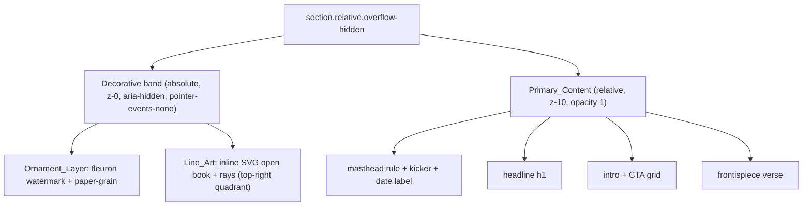

# Design Document

## Overview

This design adds two restrained decorative layers to the homepage hero
(`components/sections/Hero.tsx`) — an **Ornament_Layer** (a large
semi-transparent fleuron watermark plus a soft paper-grain wash) and a thin
gold **Line_Art** illustration anchored in the empty upper-right head region.
The change is **purely visual / presentational**: no new data, props, routes,
state, navigation, or interaction are introduced, and no existing markup is
removed. The hero's text, links, locale handling, and reveal choreography are
left intact; the decorative layers are added *behind* the existing content.

The implementation favors inline SVG and CSS over raster imagery, sources every
color from the existing ink/gold tokens (CSS variables and Tailwind classes),
works in both light and dark themes, scales responsively from mobile to desktop,
and honors `prefers-reduced-motion`.

### Chosen Line-Art Motif (and rationale)

The user explicitly excluded the cross motif and asked for a motif that fits the
Scripture / grace / editorial-literary "printed-page frontispiece" feel. From
the candidate set (open book/scroll, radiating light rays, olive branch/wheat
sprig, dove, illuminated vine flourish, quill), the design uses:

> **Primary motif: an open book with fine light rays rising from its gutter.**

Rationale:

- **Thematic fit.** The hero headline is literally *"Thinking slowly, reading
  Scripture with honesty."* An open book is the most direct, calm emblem of
  *reading Scripture*; the soft rays rising from the gutter read as *grace /
  illumination* (echoing the frontispiece verse, Romans 5:8) without resorting
  to a cross or anything overtly iconographic.
- **Compositional balance.** An open book is a wide, low, roughly triangular
  shape. Placed top-right it fills the empty head region and counter-weights the
  left-aligned masthead kicker and the long headline, while its open "fan" of
  pages mirrors the radiating gold rules already used around the frontispiece
  verse — so it feels native to the existing layout.
- **Minimalism.** It reduces cleanly to a handful of thin strokes (two page
  curves, a spine, three or four short rays), keeping the SVG tiny and the
  result calm rather than illustrative.

A secondary **illuminated vine flourish** is documented as a fallback ornament
detail (used only as part of the watermark family, not as a second focal motif)
should the book ever need to be suppressed; the architecture below treats the
motif as a single swappable SVG so this is a content change, not a structural
one.

## Architecture

The hero `<section>` is already `position: relative; overflow: hidden`, which is
exactly the containing block and clipping boundary the decorative layers need —
no structural wrapper changes are required.

Three stacking bands are established inside the existing section:

```
<section class="relative overflow-hidden">   ← clipping + positioning context (unchanged)
  ├─ Decorative band   (z-0, absolute, aria-hidden, pointer-events:none)
  │    ├─ Ornament_Layer   → fleuron watermark + paper-grain wash
  │    └─ Line_Art         → inline SVG open-book + rays (upper-right)
  └─ Primary_Content band (relative z-10)     ← existing masthead/headline/intro/CTA/verse
```

Stacking is guaranteed by giving the decorative band `z-0` (absolute, so it
leaves the flow) and adding `relative z-10` to the existing content container.
Because the decorative band is `absolute inset-0` it contributes **no layout
box** to the flow, so it cannot shift the headline (addresses CLS) and cannot
widen the document (the section's `overflow-hidden` clips any bleed).



### Layering and pointer behavior

- The decorative band carries `aria-hidden="true"` and `pointer-events-none`, so
  it is invisible to assistive technology, never receives pointer/focus events,
  and never alters the focus order — clicks pass through to the links beneath.
- The `Primary_Content` container is given `relative z-10` and its text remains
  at full opacity (`1.0`); only the decorative layers are dimmed.

### Theming strategy

All decorative color comes from the **existing** tokens, which already flip with
`html.dark`:

- `--gold` (light `#b8924a` → dark `#cdab68`) and `--accent`, consumed via the
  existing `.fleuron` rule (`color: var(--gold)`) and via Tailwind
  `text-gold-500 dark:text-gold-300` on the SVG parent (SVG strokes use
  `stroke="currentColor"`).
- The paper-grain reuses the existing `bg-grain` background image / the
  `.grain-overlay` pattern, whose `mix-blend-mode` and opacity are already
  defined per theme in `globals.css`.

Because tokens are CSS variables driven by the `html.dark` class, a theme toggle
recolors every decorative element on the next style recalculation (well within
the 400ms budget) with no stale colors and no per-theme JavaScript.

## Components and Interfaces

This feature is implemented entirely inside the existing `Hero` component plus a
few additive utility classes in `globals.css`. No new files, exports, props, or
public interfaces are introduced.

### `Hero.tsx` modifications (additive only)

1. **Wrap content for stacking.** Add `relative z-10` to the existing inner
   content container(s) so they sit above the decorative band. No markup is
   removed or reordered.
2. **Insert the decorative band** as the first child of the `<section>`:

   ```tsx
   {/* Decorative layer — purely presentational, behind Primary_Content */}
   <div aria-hidden="true" className="pointer-events-none absolute inset-0 z-0">
     {/* Ornament_Layer: large fleuron watermark */}
     <span className="hero-fleuron-watermark fleuron" aria-hidden>&#10070;</span>
     {/* Ornament_Layer: soft paper-grain wash (reuses existing grain) */}
     <span className="hero-grain-wash absolute inset-0 bg-grain" aria-hidden />
     {/* Line_Art: open book + rays, upper-right quadrant */}
     <motion.div
       custom={0}
       variants={reveal}
       initial="hidden"
       animate="show"
       className="hero-lineart hidden text-gold-500 dark:text-gold-300 md:block"
     >
       <OpenBookLineArt />  {/* inline SVG, defined locally in this file */}
     </motion.div>
   </div>
   ```

   `OpenBookLineArt` is a tiny local function returning inline `<svg>` markup
   (no new module, no asset request). It uses `stroke="currentColor"`,
   `fill="none"`, `vectorEffect="non-scaling-stroke"`, and `strokeWidth` ≤ 1.5.

3. **Reuse existing motion.** The `Line_Art` uses the hero's existing `reveal`
   variant (`duration: 0.7`, `ease: [0.16, 0.84, 0.3, 1]`) — no new easing or
   keyframe is introduced. Framer Motion's reduced-motion handling plus a CSS
   `@media (prefers-reduced-motion: reduce)` rule force the resting state.

### Inline SVG: `OpenBookLineArt`

- A single `<svg>` with `viewBox="0 0 120 90"`, `width`/`height` controlled by
  the `.hero-lineart` utility, `overflow="visible"` off, `role` omitted (parent
  is `aria-hidden`).
- Paths: two mirrored page curves, a short central spine, and 3–4 short rays
  fanning up from the gutter. All `stroke="currentColor" fill="none"
  stroke-width="1.25" stroke-linecap="round"`.
- Estimated serialized size: ~1.5–2.5 KB uncompressed.

### New `globals.css` utility classes (additive)

```css
/* ── Hero decorative layer ─────────────────────────────────────────────
 * Purely presentational. Colors come only from existing tokens; opacities
 * stay within the spec'd ranges; motion is suppressed under reduced-motion.
 */

/* Line-art opacity per theme (5–20% range). Color is inherited via
   currentColor from text-gold-* on the element. */
.hero-lineart {
  position: absolute;
  top: 3.5rem;          /* sits beside the date label, below the masthead rule */
  right: 1.25rem;       /* matches container px-5; clipped by section overflow */
  opacity: 0.12;        /* Light_Mode: within 0.05–0.20 */
  width: 9rem;          /* desktop default; scaled down for tablet below */
}
html.dark .hero-lineart {
  opacity: 0.16;        /* Dark_Mode: within 0.05–0.20 */
}

/* Large fleuron watermark — bleeds off the top-right, very faint. */
.hero-fleuron-watermark {
  position: absolute;
  top: -2rem;
  right: -1rem;
  font-size: 16rem;
  line-height: 1;
  opacity: 0.08;        /* Light_Mode: within 0.00–0.12 */
  user-select: none;
}
html.dark .hero-fleuron-watermark {
  opacity: 0.06;        /* Dark_Mode: within 0.00–0.08 */
}

/* Paper-grain wash — leans on the existing grain image; kept subtle. */
.hero-grain-wash {
  opacity: 0.5;
  mix-blend-mode: multiply;
}
html.dark .hero-grain-wash {
  opacity: 0.18;
  mix-blend-mode: screen;
}

/* Tablet (768–1023px): intermediate scale, still clear of the headline. */
@media (min-width: 768px) and (max-width: 1023.98px) {
  .hero-lineart {
    width: 6.5rem;
    top: 3rem;
  }
}

/* Reduced motion: decorative layers render in their final resting state. */
@media (prefers-reduced-motion: reduce) {
  .hero-lineart {
    transition: none;
    animation: none;
  }
}
```

(Exact rem values are tuning parameters; the constraints they satisfy — opacity
ranges, quadrant placement, no-overlap, per-theme color — are fixed by the
requirements.)

## Data Models

This feature introduces **no data models, no state, and no props**. It is a
static presentational layer. The only "model" is the conceptual decorative
configuration, which is expressed directly in markup/CSS rather than runtime
data:

| Concept | Representation | Notes |
| --- | --- | --- |
| Line_Art motif | Inline `<svg>` paths in `Hero.tsx` | Open book + rays; `currentColor` strokes |
| Line_Art opacity | `.hero-lineart` (`0.12` light / `0.16` dark) | Within required 5–20% |
| Fleuron watermark opacity | `.hero-fleuron-watermark` (`0.08` light / `0.06` dark) | Within ≤0.12 light / ≤0.08 dark |
| Grain wash | `.hero-grain-wash` + existing `bg-grain` | Reuses existing texture/blend |
| Color source | `var(--gold)` / `text-gold-*` tokens | No literals introduced |
| Stacking | decorative `z-0`, content `z-10` | Content always foremost |
| Responsive scale | `hidden` <768, tablet override, full ≥1024 | See media queries |

## Error Handling

There is no runtime logic, I/O, or asynchronous behavior, so there are no error
paths in the conventional sense. The relevant failure modes are visual/graceful
degradation:

- **Webfont / glyph unavailable for the fleuron.** The fleuron uses a Unicode
  ornament glyph (`&#10070;`) already used elsewhere in the hero; if a platform
  lacks it the watermark simply renders a fallback glyph or nothing — content is
  unaffected because the layer is `aria-hidden` and behind the text.
- **CSS variables undefined (e.g., FOUC before stylesheet loads).** Strokes fall
  back to inherited `currentColor`; worst case the line-art is briefly invisible
  or default-colored, never blocking text paint.
- **`overflow-hidden` is the safety net for bleed.** Any decorative element that
  extends past the section edge (intentionally, for the watermark) is clipped,
  guaranteeing no horizontal scrollbar from 320–1920px.
- **Reduced-motion / no-JS.** If framer-motion does not run, the line-art is
  still present via CSS at its resting opacity; the CSS reduced-motion rule
  ensures a static end state regardless of JS.

## Testing Strategy

### Why property-based testing does not apply

This feature is **UI rendering and layout** — decorative SVG/CSS with no pure
function, no input space to quantify over, and no input/output transformation.
Per the project's testing guidance, PBT is not appropriate for UI rendering,
layout, or styling; there is no meaningful "for all inputs X, property P(X)
holds" statement to make about a static decorative layer. Accordingly, **no
Correctness Properties section is included**, and verification relies on
example-based, snapshot/visual-regression, and manual accessibility checks.

### Unit / component tests (example-based)

Using the project's existing React testing setup:

- **Stacking & visibility:** the decorative band renders with `aria-hidden`,
  `pointer-events-none`, and `z-0`; the content container has `z-10`. (Req 1.3,
  2.2, 3.1, 3.2, 6 wiring)
- **No color literals:** assert the rendered SVG/markup uses `currentColor` /
  token classes and contains no `#`, `rgb(`, or `hsl(` literals in
  feature-authored markup. (Req 4.3)
- **Responsive class contract:** the line-art element carries `hidden md:block`
  (hidden on mobile) and the tablet/desktop sizing hooks. (Req 5.1–5.3)
- **Reduced-motion:** with `prefers-reduced-motion` mocked, the line-art is
  rendered in its resting state (no animated transform/opacity). (Req 7.1, 7.3)
- **Payload guard:** a test measures the serialized size of the decorative
  markup + associated CSS and asserts it is ≤ 15 KB. (Req 6.3)

### Snapshot / visual-regression tests

- Light-mode and dark-mode snapshots of the hero confirm per-theme colors and
  opacities, and that no decorative stroke is painted over headline/CTA glyphs.
  (Req 2.3, 2.4, 3.3, 4.1, 4.2, 4.5)
- Viewport snapshots at 320, 375, 768, 1024, 1440, 1920 px confirm quadrant
  placement, intermediate tablet scale, mobile suppression, and absence of
  horizontal overflow. (Req 5.1–5.4)

### Manual / accessibility verification

- WCAG 2.1 SC 1.4.3 contrast check (≥4.5:1) of headline and CTA against the
  composited decorative background in both themes, including a sampled frame
  mid-animation. (Req 3.4, 3.5)
- Tab-order check confirming the decorative band is skipped and links remain
  reachable. (Req 2.6, 3.1)
- Network panel check confirming no raster image request is issued for the
  decoration. (Req 6.1, 6.2)
- Performance trace confirming CLS contribution ≤ 0.01 and that decoration does
  not block first text paint. (Req 6.4, 6.5)
- Theme-toggle check confirming colors update within 400ms with no stale tokens.
  (Req 4.4)

## Requirements Traceability

| Requirement (criterion) | Design element that satisfies it |
| --- | --- |
| 1.1 Line_Art in upper-right quadrant | `.hero-lineart` `top`/`right` placement in the top-right of the head region |
| 1.2 No overlap with date label (desktop) | `top: 3.5rem` places art below the masthead rule / beside but clear of the date kicker; verified by snapshot |
| 1.3 Behind Primary_Content | decorative band `z-0`, content `z-10` |
| 1.4 Visible in both themes | `currentColor` from `text-gold-500 dark:text-gold-300` |
| 1.5 Opacity 5–20% | `.hero-lineart` `0.12` light / `0.16` dark |
| 1.6 No overlap of text below desktop | `hidden` on mobile + tablet override sizing clear of headline |
| 2.1 1–3 ornament elements, non-informational | fleuron watermark + grain wash (2), `aria-hidden`, stroke ≤1.5 |
| 2.2 Ornament behind content | inside `z-0` decorative band |
| 2.3 Fleuron opacity ≤0.12 (light) | `.hero-fleuron-watermark` `0.08` |
| 2.4 Fleuron opacity ≤0.08 (dark) | `html.dark .hero-fleuron-watermark` `0.06` |
| 2.5 Only existing Gold_Token colors | `.fleuron` `color: var(--gold)`; no literals |
| 2.6 Non-interactive | `pointer-events-none` + `aria-hidden` on band |
| 3.1 `pointer-events: none` | decorative band `pointer-events-none` |
| 3.2 Content opacity 1.0, above all decoration | content `z-10`, text opacity unchanged |
| 3.3 No stroke within content glyph boxes | placement + `overflow-hidden`; verified by snapshot |
| 3.4 ≥4.5:1 contrast both themes | low opacities behind text; manual contrast check |
| 3.5 ≥4.5:1 during animation | only faint opacity/translate of art; manual frame check |
| 4.1 / 4.2 No cross-theme token bleed | all colors via `--gold` / `text-gold-*` which flip on `html.dark` |
| 4.3 Zero hard-coded color literals | tokens + `currentColor` only; asserted in test |
| 4.4 Recolor within 400ms on toggle | CSS-variable-driven recolor on class change |
| 4.5 Opacity ≤0.20 | line-art ≤0.16, watermark ≤0.08 |
| 5.1 Mobile: no overlap / hidden | `.hero-lineart` `hidden` below `md` |
| 5.2 Tablet intermediate scale | `@media 768–1023.98px` width override |
| 5.3 Desktop full scale in quadrant | default `.hero-lineart` width at `md:block` / ≥1024 |
| 5.4 No horizontal overflow 320–1920 | section `overflow-hidden` clips bleed |
| 6.1 Inline SVG/CSS, no raster | inline `<svg>` + CSS, reused `bg-grain` data-URI |
| 6.2 No external image request | no ``/`url()` to remote asset |
| 6.3 ≤15 KB combined payload | ~2–3 KB SVG + small CSS; asserted in test |
| 6.4 ≤0.01 CLS | absolutely positioned, no flow box |
| 6.5 Non-render-blocking | decoration paints with/after text; no blocking asset |
| 7.1 Reduced-motion resting state | `@media (prefers-reduced-motion)` + framer-motion handling |
| 7.2 Reuse existing duration/easing | hero `reveal` variant `0.7` / `[0.16,0.84,0.3,1]` |
| 7.3 Stop animation when RM becomes active | reduced-motion media query forces static end state |
